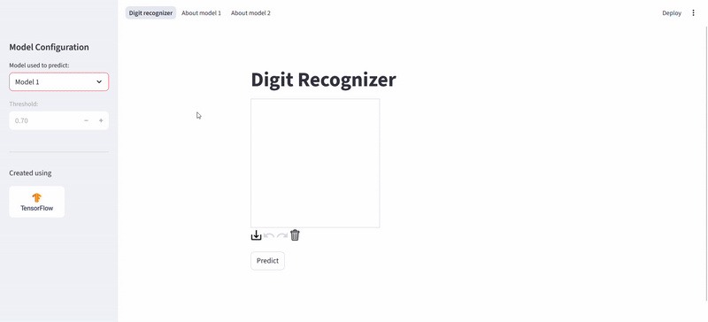

# digit-recognizer
Handwritten digit recognition system with an interactive interface to draw and test predictions built with [TensorFlow] ([Keras]) and [Streamlit].  

The project trains two different **Convolutional Neural Networks (CNNs)** on the **MNIST dataset** and provides a web interface to draw digits, visualize predictions and compare models.

- **Draw digits** directly in the app canvas.  
- **Choose between models** or choose to create an ensemble prediction with adjustable weights.  
- **Visualize model confidence** with probability charts.  
- **Inspect model architecture** using automatically generated [Graphviz] diagrams.  
- **Review training history** and test results interactively.  
- Built entirely with **Python**, no external web dependencies required.

You can draw digits directly in the app and see the model’s prediction in real time.

<p align="center">
  
</p>

View all information of either model

<p align="center">
  
</p>

[TensorFlow]: https://github.com/tensorflow/tensorflow
[Keras]: https://github.com/keras-team/keras
[Streamlit]: https://github.com/streamlit/streamlit
[Graphviz]: https://github.com/xflr6/graphviz

---

## Models

### Model 1
A smaller CNN with:
- Two convolutional and pooling layers  
- One dense hidden layer  
- About 100k parameters  

### Model 2
A deeper CNN featuring:
- Three convolutional layers 
- Two pooling layers 
- Dropout for regularization
- One dense hidden layer
- About 300k parameters  

Both are trained on the MNIST dataset for 5 epochs using Adam optimizer and categorical cross-entropy loss.

### Accuracy
|             | Test accuracy | Test loss |
|-------------|:-------------:|:---------:|
| **Model 1** |      99%      |  0.0309   |
| **Model 2** |    99.19%     |  0.0258   |

After training, both models are tested on a 10% hold-out portion of the MNIST dataset, achieving over 99% accuracy.

Results may slightly vary between runs due to TensorFlow’s random weight initialization and stochastic training process.

---

## Training

To train both models, simply run:

`python src/train_model.py`

After that, you can run the app:

`streamlit run src/app.py`

---

## Tech Stack

| Category         | Libraries              |
|------------------|------------------------|
| Deep Learning    | [TensorFlow] / [Keras] |
| Web App          | [Streamlit]            |
| Visualization    | [Altair], [Graphviz]   |
| Data             | [NumPy], [Pandas]      |
| Image Processing | [Pillow]               |

[Altair]: https://github.com/vega/altair
[NumPy]:  https://github.com/numpy/numpy
[Pandas]: https://github.com/pandas-dev/pandas
[Pillow]: https://github.com/python-pillow/Pillow

---

## Project Structure
```
digit-recognizer/
│
├── models/               # Trained models al training history
│   ├── mnist_cnn1.keras  # Model 1
│   ├── mnist_cnn2.keras  # Model 2
│   ├── history1.json     # Trainig history of model 1
│   └── history2.json     # Trainig history of model 1
│
├── src/                  # Source code 
│   ├── app.py            # Streamlit navigation and page management
│   ├── recognizer.py     # Digit drawing canvas and model predictions
│   ├── model1.py         # Page with Model 1 details
│   ├── model2.py         # Page with Model 2 details
│   ├── model_view.py     # Shared visualization utilities (plots, diagrams)
│   └── train_model.py    # Model training script (creates .keras and .json files)
│
├── img/                  # GIFs for README
│   ├── demo_drawing.gif
│   └── demo_models.gif
│
├── requirements.txt
├── README.md
└── .gitignore
```
